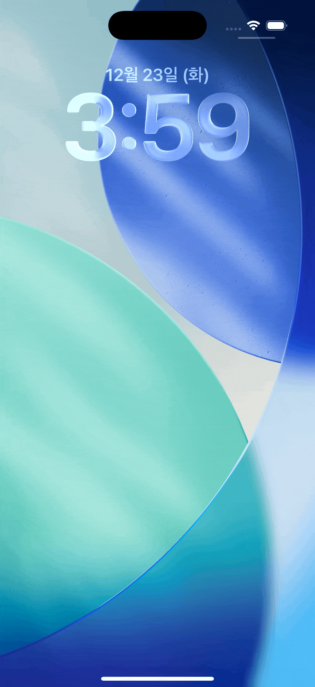

# Alarm Kit 살펴보기

AlarmKit과 Live Activity를 빠르게 둘러볼 수 있는 iOS 26.1+ 데모앱입니다.
(알람 예약, 카운트다운, Dynamic Island)

## 주요 기능

- AlarmKit 권한 요청 및 상태 관리 (`AlarmKit_LittleTale/ViewModel.swift`)
- 날짜/시각 알람 예약과 커스텀 알림 UI (`AlarmKit_LittleTale/ContentView.swift`의 `setAlarm()`)
- 프리/포스트 알림이 포함된 카운트다운 알람, 일시정지/재개/취소 지원 (`setAlarmWithCountDown()`)
- Live Activity + Dynamic Island 레이아웃과 AppIntent 버튼 제어 (`CountDownWidget/CountDownWidgetLiveActivity.swift`, `CountDownWidget/AlarmActionIntent.swift`)
- 메타데이터로 전달되는 알람 타입 아이콘 (`AlarmKit_LittleTale/Data/MyAlarmMetaData.swift`)

## 프로젝트 구조

- `AlarmKit_LittleTale/ContentView.swift`: 권한 확인 후 알람/타이머 버튼 제공
- `AlarmKit_LittleTale/ViewModel.swift`: MVI 패턴으로 상태와 토스트/알림 관리
- `AlarmKit_LittleTale/MVIContainer.swift`: 간단한 MVI 베이스 클래스
- `AlarmKit_LittleTale/Data/MyAlarmMetaData.swift`: Live Activity에서 사용할 메타데이터와 아이콘
- `CountDownWidget/CountDownWidgetLiveActivity.swift`: 잠금화면·Dynamic Island UI 구성, 카운트다운 표시
- `CountDownWidget/AlarmActionIntent.swift`: AppIntent로 Live Activity를 일시정지/재개/취소

## 데모

|                                     Alarm Setting                                     |                                     Timer Setting                                     |
| :-----------------------------------------------------------------------------------: | :-----------------------------------------------------------------------------------: |
| <picture></picture> | <picture></picture> |

## 사용 방법

1. 앱 실행 후 권한을 허용합니다.
2. `Date & Time`에서 시각을 고르고 `set Alarm`을 누르면 지정 시각 알람이 예약됩니다. `Open App` 보조 버튼을 포함한 커스텀 알림이 표시됩니다.
3. `Count Down`을 누르면 10초 프리/포스트 알림이 있는 카운트다운 알람이 시작되고, Live Activity/Dynamic Island에 남은 시간이 표시됩니다.
4. Dynamic Island의 AppIntent 버튼으로 일시정지/재개/취소를 바로 수행할 수 있습니다.

## AlarmKit 사용 스니펫

```swift
let alert = AlarmPresentation.Alert(
    title: "일어나",
    secondaryButton: AlarmButton(text: "Go To App", textColor: .blue, systemImageName: "app.fill"),
    secondaryButtonBehavior: .custom
)

let attributes = AlarmAttributes<MyAlarmMetaData>(
    presentation: AlarmPresentation(alert: alert),
    metadata: MyAlarmMetaData(method: .wakeUp),
    tintColor: .orange
)

let config = AlarmManager.AlarmConfiguration(
    schedule: .fixed(scheduleDate),                   // 지정 시각 알람
    attributes: attributes,
    secondaryIntent: OpenAppIntents(id: id)           // 알림 버튼 동작
)

try await AlarmManager.shared.schedule(id: id, configuration: config)
```

카운트다운은 `Alarm.CountdownDuration(preAlert: 10, postAlert: 10)`과 `AlarmPresentation.Countdown/Pau​​sed`를 통해 Live Activity에 시간을 보여주고, `AlarmActionIntent`로 제어합니다.

## 참고 사항

- AlarmKit API 제약으로 알람은 과거 시각에 예약할 수 없습니다(앱에서 에러 메시지 제공).
- Live Activity UI는 잠금화면과 Dynamic Island 모두에 맞춰 최소한의 텍스트·버튼만 배치했습니다. 필요에 맞게 `CountDownWidgetLiveActivity.swift`를 확장하세요.
